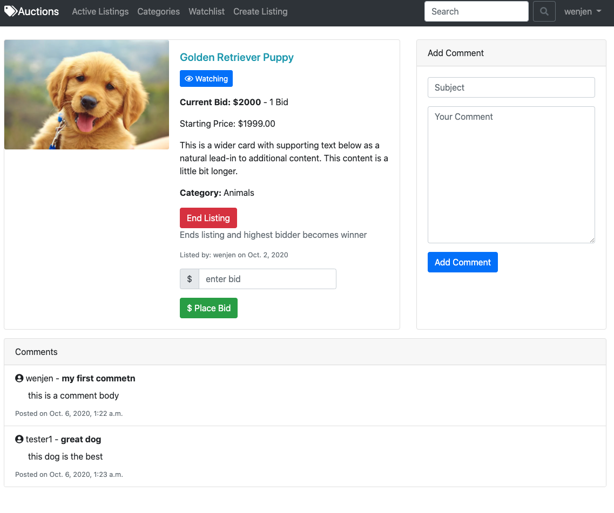

# Auctions Commerce Site

## Project Overview:

Deployed on heroku: [https://rmw-mobile-web-specialist.herokuapp.com/](https://frontend-mws.herokuapp.com/)

An ecommerce auctions website built with django/python. Provides a full featured authentication system along with email password reset. Features and technologies include:

- CRUD Listings/Comments
- Saved watchlist based on user
- Bid placement and comment sections
- A fully responsive layout
- User authentication and login/logout
- Javascript
- Bootstrap

### Quick Start Guide

1. Python Version used 3.8.5
2. `pip install -r requirements.txt`
3. `python manage.py runserver`

